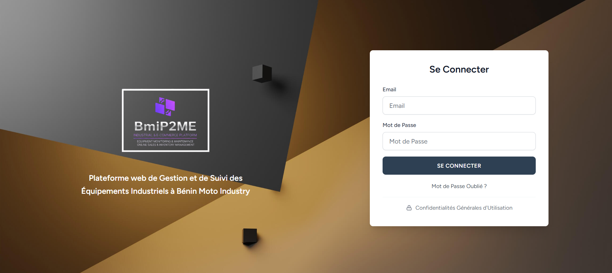
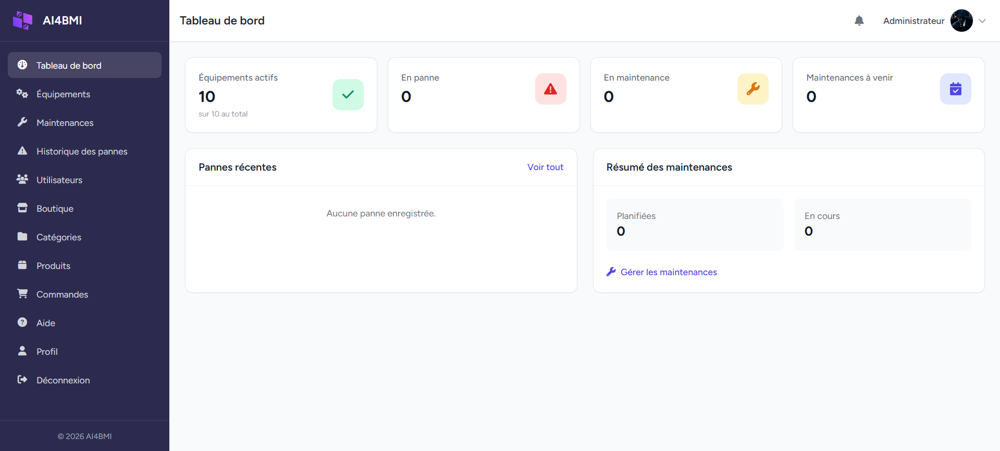
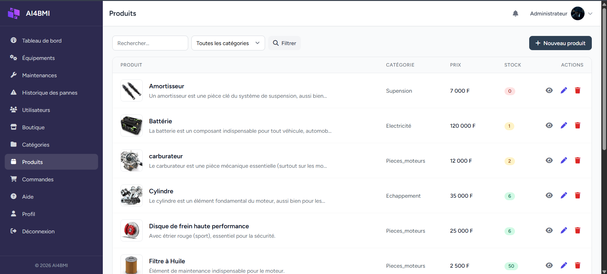

# AI4BMI — Backend Laravel

Backend de la plateforme **Bénin Moto Industry (BMI)** : gestion des équipements industriels, maintenance, pannes et **e-commerce** (API pour l’app mobile).

---

## Liens utiles

| | Lien |
|---|------|
| **Backend (prod)** | https://ai4bmi.cabinet-xaviertermeau.com |
| **API (prod)** | https://ai4bmi.cabinet-xaviertermeau.com/api |
| **Documentation API (Swagger)** | https://ai4bmi.cabinet-xaviertermeau.com/api-docs |
| **Rapport du projet** | [Google Drive](https://drive.google.com/file/d/1H9bnzjzVUHdszRzE9Nv4RieIM3vsikzl/view?usp=drive_link) |


## Accès de test (back-office)

Après `php artisan db:seed`, un compte administrateur est créé pour accéder au dashboard :

| | Valeur |
|---|--------|
| **URL connexion** | https://ai4bmi.cabinet-xaviertermeau.com/login |
| **Email** | `abdoulrachard@gmail.com` |
| **Mot de passe** | `password` |

  
*Écran de connexion au back-office.*

  
*Tableau de bord après connexion.*

  
*Admin e-commerce — produits et commandes.*

---

## Stack

- **Backend** : Laravel
- **Base de données** : MySQL
- **Auth** : Laravel Breeze (Blade) + Sanctum (API mobile)
- **Frontend back-office** : Blade (gestion équipements, maintenances, pannes, admin e-commerce)

---

## Installation locale

**Prérequis** : PHP >= 8.2, Composer, MySQL >= 5.7, Node.js >= 18

```bash
git clone https://github.com/IFRI-Hackaton-L3-2025-2026/GL-Hack2026-Groupe_5_Backend.git
cd GL-Hack2026-Groupe_5_Backend
composer install
npm install
cp .env.example .env
php artisan key:generate
```

Configurer la base dans `.env` (DB_DATABASE=ai4bmi, etc.), puis :

```bash
php artisan migrate
php artisan db:seed
npm run build
php artisan serve
```

- **Back-office** : http://localhost:8000 (login avec le compte admin ci-dessus)
- **Swagger** : http://localhost:8000/api-docs

---

## API mobile (e-commerce)

L’API utilisée par l’app mobile (auth, catalogue, panier, commandes, paiement FedaPay) est documentée ici :

- **Référence détaillée** : [docs-reference-pour-app-mobil/API_MOBILE_REFERENCE.md](docs-reference-pour-app-mobil/API_MOBILE_REFERENCE.md) (si le fichier existe dans le dépôt)
- **Swagger** : `/api-docs` (générer avec `composer run swagger` après modification des contrôleurs API)

---

## Équipe

- AMADOU Hik Math  
- HOUNGA Nehme  
- LAWINGNI Abdoul  
